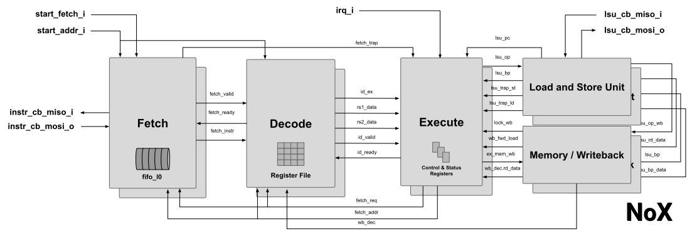

# NoX RISC-V Core

## Table of Contents
* [Introduction](#intro)
* [Quickstart](#quick)
* [RTL uArch](#uarch)
* [Compliance Tests](#compliance)
* [CoreMark](#coremark)
* [License](#lic)

## <a name="intro"></a> Introduction
NoX is a 32-bit RISC-V core designed in System Verilog language aiming both `FPGA` and `ASIC` flows. The core was projected to be easily integrated and simulated as part of an SoC, with `makefile` targets for simple standalone simulation or with an interconnect and peripherals. In short, it is specifications are listed:

- RV32IZicsr
- 4 stages / single-issue / in-order pipeline
- M-mode privileged spec.
- Misaligned loads & stores support
- Software/External/Timer interrupt
- Support non/vectored IRQs
- Configurable fetch FIFO size
- AXI4 or AHB I/F

The CSRs that are implemented in the core are listed down below, more CSRs can be easily integrated within [rtl/csr.sv](rtl/csr.sv) by extending the decoder. Instructions such as `ECALL/EBREAK` are supported as well and will synchronously trap the core, forcing a jump to the `MTVEC` value. All interrupts will redirect the core to the `MTVEC` as well as it is considered asynchronous traps.

|    |    CSR   |           Description           |
|:--:|:--------:|:-------------------------------:|
|  1 |  mstatus |         Status register         |
|  2 |    mie   |     Machine Interrupt enable    |
|  3 |   mtvec  |     Trap-vector base-address    |
|  4 | mscratch |         Scratch register        |
|  5 |   mepc   |    Exception program counter    |
|  6 |  mcause  |      Machine cause register     |
|  7 |   mtval  |        Machine trap value       |
|  8 |    mip   |    Machine pending interrupt    |
|  9 |   cycle  |       RO shadow of mcycle       |
| 10 |  cycleh  | RO shadow of mcycle [Upper 32b] |
| 11 |   misa   |       Machine ISA register      |
| 12 |  mhartid |         Hart ID register        |

## <a name="quick"></a> Quickstart
**NoX** uses a [docker container](https://hub.docker.com/repository/docker/aignacio/nox) to build and simulate a standalone instance of the core or an SoC requiring no additional tools to the user apart from docker itself. To quickly build a simple instance of the core with two memories and simulate it through linux, follow:

```bash
make all # Will first download the docker container and build the design
make run # Should simulate the design for 100k clock cycles 
```
You should expect in the terminal an output like this:
```bash

  _   _       __  __
 | \ | |  ___ \ \/ /
 |  \| | / _ \ \  /
 | |\  || (_) |/  \
 |_| \_| \___//_/\_\
 NoX RISC-V Core RV32I

 CSRs:
 mstatus        0x1880
 misa           0x40000100
 mhartid        0x0
 mie            0x0
 mip            0x0
 mtvec          0x80000101
 mepc           0x0
 mscratch       0x0
 mtval          0x0
 mcause         0x0
 cycle          110

[ASYNC TRAP] IRQ Software
[ASYNC TRAP] IRQ timer
[ASYNC TRAP] IRQ External
[ASYNC TRAP] IRQ External
[ASYNC TRAP] IRQ Software
[ASYNC TRAP] IRQ timer
...
```
If you have [gtkwave](http://gtkwave.sourceforge.net) installed, you can also open the simulation run `fst` with:
```
make GTKWAVE_PRE="" wave
```
For more `targets`, please run
```bash
make help
```

## <a name="uarch"></a> RTL micro architecture
NoX core is a **4-stages** single issue, in-order pipeline with [**full bypass**](https://en.wikipedia.org/wiki/Classic_RISC_pipeline#Solution_A._Bypassing), which means that all data hazards will have no impact in terms of stalling the design. The only scenario where we can have a *stall* is when the core has back-pressure from the LSU due to some pending operation on-the-fly. The micro-architecture is presented in the figure below with all the signals matching the top [rtl/nox.sv](rtl/nox.sv).

In the file [rtl/inc/nox_pkg.svh](rtl/inc/nox_pkg.svh), there are two presets of `verilog` macros (Lines 8/9) that can be un/commented depending on the final target. For `TARGET_FPGA`, it is defined an **active-low** & **synchronous reset**. Otherwise, if the macro `TARGET_ASIC` is defined, then this change to **active-high** & **asynchronous reset**. In case it is required another combination of both, please follow what is coded there.

## <a name="compliance"></a> RISC-V ISA Compliance tests
To run the compliance tests, two steps needs to be followed.
1. Compile nox_sim with 2MB IRAM / 128KB DRAM
2. Run the RISCOF framework using SAIL-C RISC-V simulator as reference

```bash
make build_comp # It might take a while...
make run_comp
```
Once it is finished, you can open the report file available at **riscof_compliance/riscof_work/report.html** to check the status.

## <a name="coremark"></a> CoreMark
Inside the [sw/coremark](sw/coremark), there is a folder called **nox** which is the platform port of the [CoreMark benchmark](https://github.com/eembc/coremark) to the core. NoX CoreMark score is **125** or **2.5 CoreMark/MHz**. If you have [Vivado](https://www.xilinx.com/products/design-tools/vivado.html) installed and want to try running in the [Arty A7 FPGA board](https://digilent.com/shop/arty-a7-artix-7-fpga-development-board/), please follow the commands below.
```bash
fusesoc library add core  .
fusesoc run --run --target=coremark_synth core:nox:v0.0.1
```
As mentioned in the [CoreMark](https://github.com/eembc/coremark) repository, the benchmark needs to run for two sets of seeds 0,0,0x66 and 0x3415,0x3415,0x66. These two sets correspond respectively to PERFORMANCE run and VALIDATION run. Thus the two outputs of the runs are presented down below. According to the reporting rules, the CoreMark score is defined by the metrics of number of iterations per second during the performance run.
**Performance run:**
```bash
 -----------
 [NoX] Coremark Start
 -----------
2K performance run parameters for coremark.
CoreMark Size    : 666
Total ticks      : 848608849
Total time (secs): 16
Iterations/Sec   : 125
Iterations       : 2000
Compiler version : riscv-none-embed-gcc (xPack GNU RISC-V Embedded GCC x86_64) 10.2.0
Compiler flags   : -O0 -g -march=rv32i -mabi=ilp32 -Wall -Wno-unused -ffreestanding --specs=nano.specs -DPRINTF_DISABLE_SUPPORT_FLOAT -DPRINTF_DISABLE_SUPPORT_EXPONENTIAL -DPRINTF_DISABLE_SUPPORT_LONG_LONG -Wall -Wno-main -DPERFORMANCE_RUN=1  -O0 -g
Memory location  : STACK
seedcrc          : 0xe9f5
[0]crclist       : 0xe714
[0]crcmatrix     : 0x1fd7
[0]crcstate      : 0x8e3a
[0]crcfinal      : 0x4983
Correct operation validated. See README.md for run and reporting rules.
```
**Validation run:**
```bash
 -----------
 [NoX] Coremark Start
 -----------
2K validation run parameters for coremark.
CoreMark Size    : 666
Total ticks      : 1080616261
Total time (secs): 21
Iterations/Sec   : 95
Iterations       : 2000
Compiler version : riscv-none-embed-gcc (xPack GNU RISC-V Embedded GCC x86_64) 10.2.0
Compiler flags   : -O0 -g -march=rv32i -mabi=ilp32 -Wall -Wno-unused -ffreestanding --specs=nano.specs -DPRINTF_DISABLE_SUPPORT_FLOAT -DPRINTF_DISABLE_SUPPORT_EXPONENTIAL -DPRINTF_DISABLE_SUPPORT_LONG_LONG -Wall -Wno-main -DVALIDATION_RUN=1  -O0 -g
Memory location  : STACK
seedcrc          : 0x18f2
[0]crclist       : 0xe3c1
[0]crcmatrix     : 0x0747
[0]crcstate      : 0x8d84
[0]crcfinal      : 0x0cac
Correct operation validated. See README.md for run and reporting rules.
```

## <a name="lic"></a> License
NoX is licensed under the permissive MIT license. Please refer to the [LICENSE](LICENSE) file for details.
